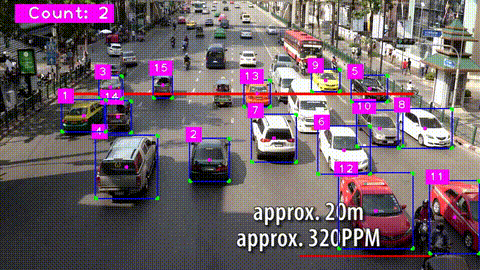

# Car Count
This is object detection project that track, assign unique id and count no of cars.

## About Model
Pretrained YOLOv8n is used in this project.

## Track and ID
Tracking and assigning a unique id to each detected car is done using this [repo.](https://github.com/abewley/sort.git)

## Result

## For Reference
Reference was taken from this [video](https://youtu.be/WgPbbWmnXJ8)