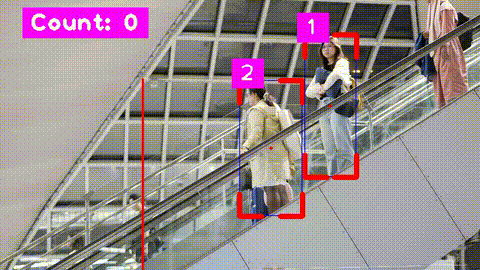

# People Counting
People Counting is a object detection project which is used to track the people, assign a unique id and count the total people.

## About Model
Pretrained YOLOv8n is used in this project.

## Track and ID
Tracking and assigning a unique id to each detected car is done using this [repo.](https://github.com/abewley/sort.git)

## Result

## For Reference
Reference was taken from this [video](https://youtu.be/WgPbbWmnXJ8)